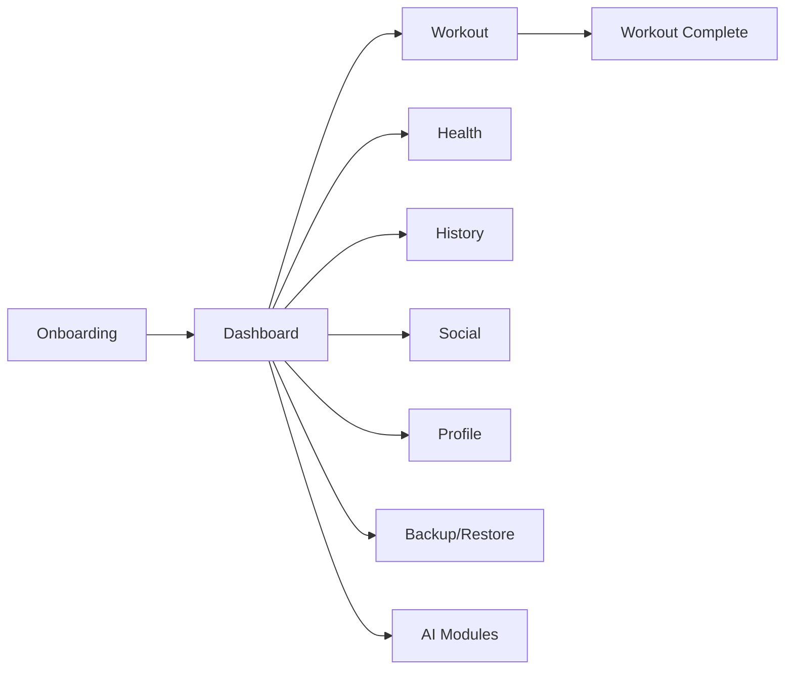

<div align="center">

# GYMPILOT

### Product-minded Frontend Engineering for real workout routines

<p>
  
  
  
  
</p>

<p>
  GymPilot is a production-style fitness web app where I designed both product experience and implementation details.
</p>

</div>

---

## Why this project matters

Most fitness apps fail in the gym because they add friction exactly when users need speed.
I built GymPilot to solve that with a clear constraint:

- one obvious action per screen
- fast visual feedback while training
- state that survives real usage, not just demos
- mobile-first navigation for noisy real-world contexts

This repository demonstrates how I think as an engineer: user intent first, architecture second, polish always.

---

## Recruiter snapshot

- Built with React 18, TypeScript, Vite, Supabase, Zustand, Tailwind
- Includes AI-assisted flows, social module, workout engine and PWA setup
- Handles edge cases from persisted state and client-side hydration
- Structured for scale: feature stores, reusable hooks, typed domain models
- Maintained with test scripts and SQL setup/reset workflows

If you are hiring for frontend product engineering, this codebase reflects how I ship practical, complete user experiences.

---

## What I built

- Workout system with weekly ABC training distribution
- Session flow with per-exercise and per-set progression
- Dashboard for "today", weekly progress and body metrics
- Nutrition and hydration tracking
- AI modules: setup, chat, re-evaluation and post-workout insights
- Social features: feed, ranking, direct conversations
- Backup/restore capabilities
- Supabase integration with schema bootstrap and reset scripts

---

## Engineering highlights

- State architecture with domain-focused Zustand stores
- Routing and UX flow optimized for low-attention environments
- Typed utility layer for dates, calories, hydration and business rules
- Realtime-ready social architecture through Supabase
- Build pipeline with Vite and TypeScript project references
- SQL scripts consolidated for reproducible environments

---

## Architecture overview



---

## Stack

- React 18
- TypeScript
- Vite 6
- Tailwind CSS
- Zustand
- Supabase
- Framer Motion
- Vitest

---

## Quick start

### 1) Install dependencies

```bash
npm install
```

### 2) Environment variables

Create a `.env` file:

```env
VITE_SUPABASE_URL=...
VITE_SUPABASE_ANON_KEY=...
```

### 3) Run locally

```bash
npm run dev
```

### 4) Production build

```bash
npm run build
```

### 5) Preview build

```bash
npm run preview
```

---

## SQL operations

Main scripts in `supabase/`:

- `setup-all.sql`: full setup (social + workout engine)
- `reset-all.sql`: destructive reset for app/auth data

Use carefully, especially on production environments.

---

## NPM scripts

| Script | Description |
|---|---|
| `npm run dev` | start development server |
| `npm run build` | TypeScript build + Vite production build |
| `npm run preview` | preview built app locally |
| `npm run deploy` | publish with gh-pages |
| `npm run ai:evals` | run AI flow evaluations |
| `npm run test:unit` | run unit tests with Vitest |
| `npm run test:ai` | run AI schema tests |

---

## High-level structure

```text
src/
  components/    ui, layout, workout widgets
  pages/         route-level screens
  stores/        domain state management
  hooks/         reusable hooks
  utils/         business logic helpers
  lib/           integration layer
  constants/     static catalog data
  types/         shared types
supabase/
  setup-all.sql
  reset-all.sql
public/
  assets/
  icons/
```

---

## Product decisions I care about

- Fast paths beat feature overload
- Visual hierarchy should communicate state instantly
- Reliability is part of UX (especially persisted state)
- Architecture should support iteration, not block it

---

## Current status

- Active development
- Production-like architecture
- Focused on product quality and evolution speed

---

## Contact

If this project aligns with your team standards, I would love to talk.

- LinkedIn: https://www.linkedin.com/in/ruan-cardozo-montanari/
- Email: ruancrdz2004@gmail.com

---

## Notes

- This app does not replace professional health guidance.
- Body and nutrition metrics should be treated as support signals.

---

<div align="center">

Built with consistency, product intent and engineering craft.

</div>
